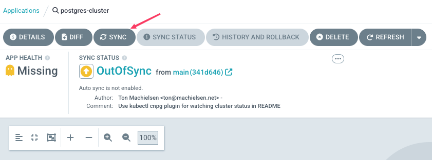
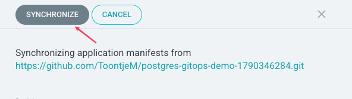
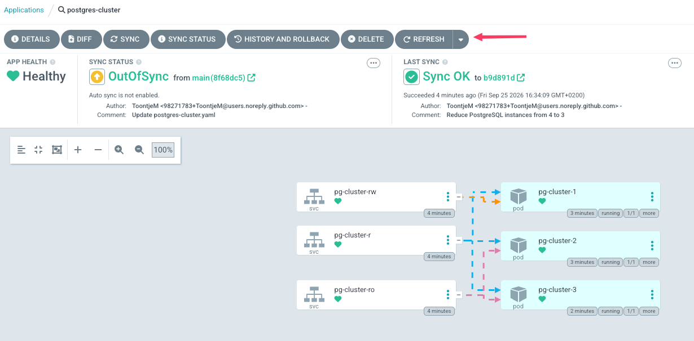
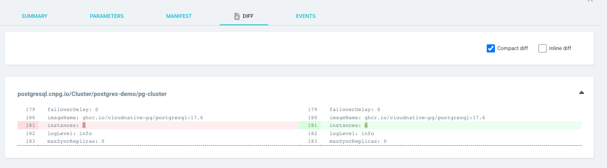
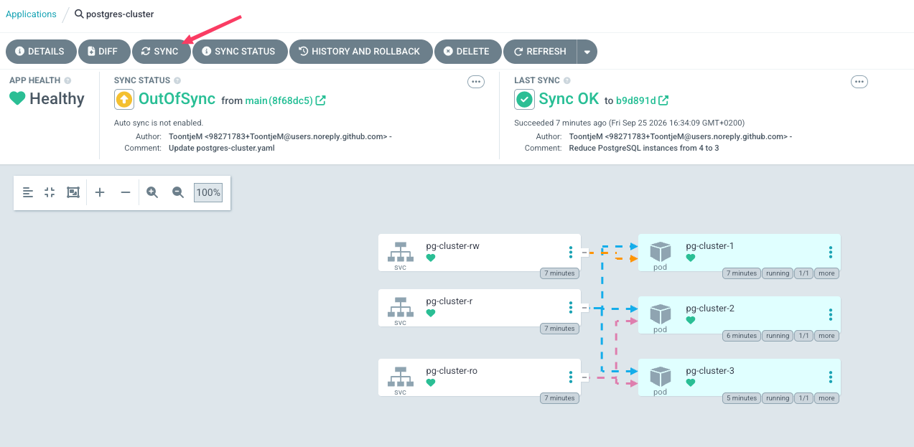
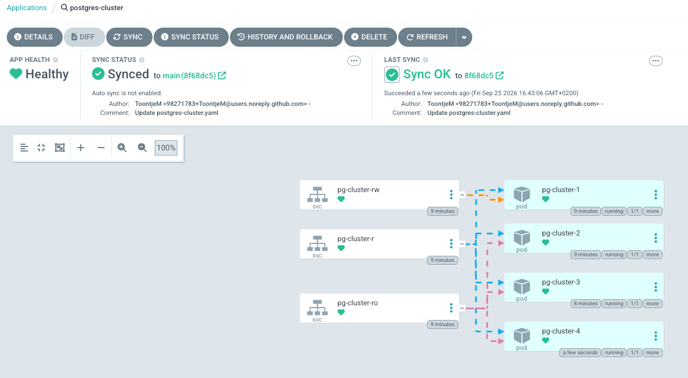

# Postgres GitOps Demo

Demonstrates managing a PostgreSQL cluster on Kubernetes with GitOps, using
[CloudNativePG](https://cloudnative-pg.io) (CNPG) as the operator, ArgoCD as
the GitOps controller, and a `kind` cluster as the local target environment.

Repo: https://github.com/ToontjeM/gitops

## Two repos

This demo spans two separate repos, on purpose:

- **This repo (`gitops`)** — the demo tooling: scripts, README, kind
  config, the ArgoCD `Application` bootstrap manifest. Everyone clones or
  pulls this; only Ton can push to it.
- **A personal `postgres-gitops-demo` repo**, created in *your own* GitHub
  account with full read/write access for you, holding *only* the
  contents of `manifests/` — the CNPG `Cluster` and its `Namespace`. This
  is the repo ArgoCD actually syncs against, since it needs something you
  can push to, and it should track just the cluster manifest, not the
  rest of the demo.

## Running this yourself

`00-provision.sh` sets up the personal manifests repo for you the first
time you run it:

1. **Prerequisite check.** Before touching anything, it verifies `git`,
   `kind`, `kubectl`, `docker`, `gh`, `curl`, and `git subtree` are
   available, that the Docker daemon is actually reachable (kind needs it
   as its container runtime), and that `gh` is authenticated
   (`gh auth status`). It exits with install/login pointers if any of that
   is missing — nothing is provisioned until these pass.
2. **Manifests-repo check.** It looks for a local git remote named
   `manifests`. If there isn't one yet, it asks:

   > Create a public GitHub repo under your account for just the cluster
   > manifest, using `gh`? [y/N]

   - **Yes** — it creates a new, empty public repo (`postgres-gitops-demo`)
     on your GitHub account via `gh repo create`, adds it as the local
     `manifests` remote, and pushes *only* the contents of `manifests/`
     into it as `main` (via `git subtree push --prefix=manifests`) — not
     the rest of this demo (scripts, README, kind config, etc).
   - **No** — the script aborts immediately. Nothing is provisioned,
     since ArgoCD would have nothing pushable to sync against. You can
     re-run and answer yes, or add a manifests repo of your own as that
     remote first: `git remote add manifests <your-repo-url>`.

   If a `manifests` remote already exists (a previous run, or one you set
   up yourself), the prompt is skipped and that repo is used as-is. This
   repo's own `origin` is never touched.
3. **Everything else** (cluster, CNPG, ArgoCD) proceeds as described
   below, with `argocd/application.yaml` templated against the
   `manifests` remote's URL.

## Layout

- `00-provision.sh` — checks prerequisites, sets up the personal
  manifests repo described above if needed (see
  [Running this yourself](#running-this-yourself)), creates the `kind`
  cluster, installs the CNPG operator, installs ArgoCD (admin password set
  to `admin` — demo convenience, never do this on a real cluster),
  registers the `postgres-cluster` Application (manual sync — nothing
  deployed yet), and starts a background port-forward so the ArgoCD UI is
  immediately reachable.
- `99-deprovision.sh` — stops that port-forward, deletes the `kind`
  cluster, and if a `manifests` remote is configured, offers to delete
  that GitHub repo too — or just tells you it's still there if it can't
  (or you'd rather not).
- `kind-config.yaml` — 1 control-plane + 3 worker node topology, so the
  3-instance Postgres cluster below can spread across separate nodes.
- `argocd/application.yaml` — the ArgoCD `Application` pointing at your
  personal manifests repo (its URL is templated in by `00-provision.sh` at
  apply time), root path (`.`), `main` branch. Applied once by
  `00-provision.sh` as a bootstrap step; it is not itself synced via
  GitOps.
- `manifests/namespace.yaml` — the `postgres-demo` namespace.
- `manifests/postgres-cluster.yaml` — the initial CNPG `Cluster` resource:
  a 3-instance, open source PostgreSQL 17.6 cluster
  (`ghcr.io/cloudnative-pg/postgresql:17.6`). This is the manifest the
  demo evolves via git commits + ArgoCD Sync.

Everything under `manifests/` is GitOps-managed by ArgoCD. Sync is
**manual** (not automated), so a demo step is: edit a manifest → commit →
`git subtree push --prefix=manifests manifests main` → click Sync (or
`argocd app sync postgres-cluster`) → watch it apply. A plain `git push`
won't work here — the `manifests` remote's history is just the split-off
`manifests/` contents, unrelated to this repo's own history.

## Usage

```
./00-provision.sh
```

The first run will prompt you to create your personal manifests repo if
needed (see [Running this yourself](#running-this-yourself)). It then
gives you a ready-to-demo environment:

- kind cluster + CNPG operator installed
- ArgoCD installed, reachable at **https://localhost:8080**
  (user `admin` / password `admin`)
- the `postgres-cluster` Application registered against your manifests
  repo — nothing deployed to `postgres-demo` yet, since sync is manual

If you've made changes under `manifests/`, push just that directory first
so ArgoCD can see them:

```
git subtree push --prefix=manifests manifests main
```

Open https://localhost:8080, log in, and click **Sync** on the
`postgres-cluster` Application (or via CLI: `argocd login localhost:8080`
then `argocd app sync postgres-cluster`). Watch it come up:

```
watch -n 1 -c kubectl cnpg get cluster -n postgres-demo --color always
```

Tear everything down when done:

```
./99-deprovision.sh
```

This stops the port-forward and deletes the kind cluster. If a
`manifests` remote is configured, it also asks whether to delete that
GitHub repo — answering no (or not having `gh` available) just leaves it
in place and says so, it won't be deleted silently.

## Demo idea (next steps)

1. Push the cluster manifest to the newly created repo in your Github account using `git subtree push --prefix=manifests manifests main`
2. Sync the manifest in ArgoCD


3. Open a terminal and run `watch -n 1 -c kubectl cnpg status -n postgres-demo pg-cluster --color allways`
4. On Github, change `postgres-cluster.yaml` and commit. For example, change the number of instances from `3` to `4`
5. Refresh ArgoCD and watch how the application is now out of sync.

6.  Click the `Diff` button and see what the differences are.

7. Sync the Application in ArgoCD

8. Watch in your cluster status how a new instance gets created.


